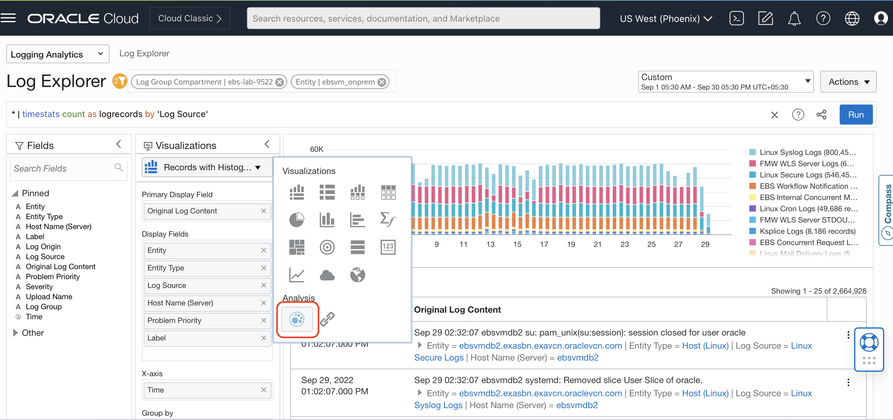
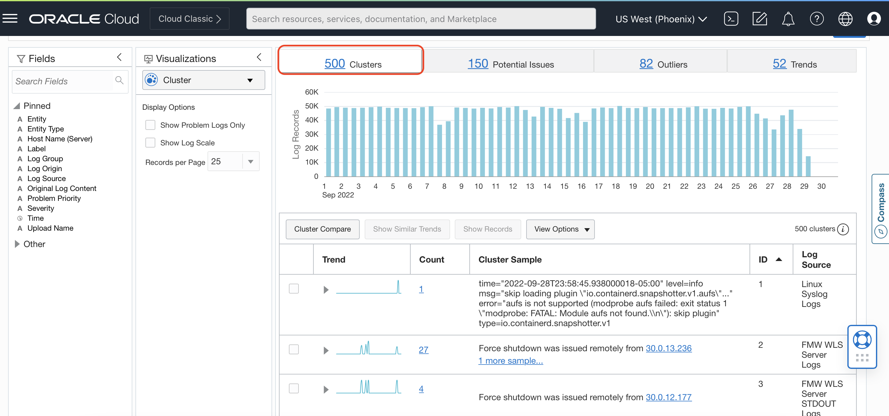
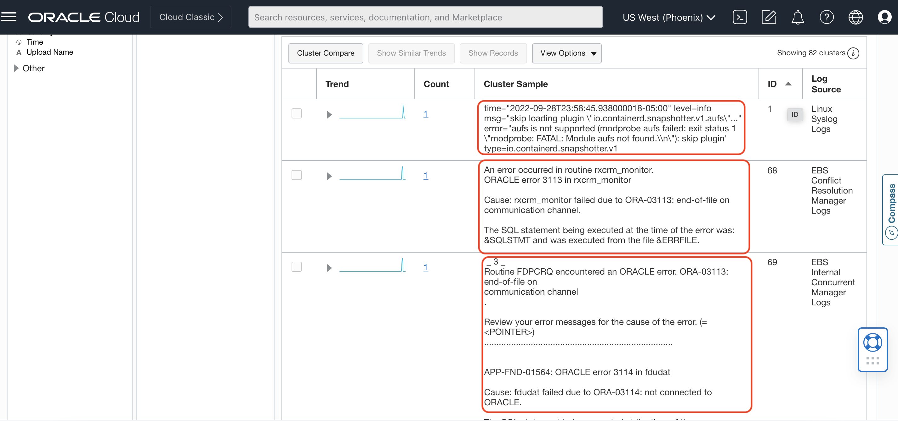

# Use ML Clustering to analyze large volume of logs

## Introduction
It is easier to visualize large volume of data as related clusters. Logging Analytics - Clustering (Unsupervised ML) uses the log data and the enriched domain expertise to find patterns in the data. Clustering works on text as well as numbers, allowing large volume of data to be reduced to fewer patterns for anomaly detection.

Estimated Lab Time: 10 minutes

### Objectives

In this lab, you will:
* Analyzing large volume of logs using cluster command

Now we will walk through Analyzing large volume of logs using cluster command.

## **Task 1:**  Analyzing large volume of logs using cluster

1. Click on the 'Cluster' visualization to invoke machine learning

  

  

2. Drill down into different clusters, potential issues, outliers and trends.

   Logging Analytics uses unsupervised ML to find related clusters in data.  This reduces the approximately 500,000 log records to 500 cluster patterns, in real time.

   **Note:** The numbers you see might be slightly different than the ones shown in the tutorial. You can use the START time **May 25, 2022 00:00 AM UTC(+00:00)** and END time **Jun 2, 2022 12:00 PM UTC(+00:00)** in the time picker to replicate these in your lab environment.

   You can also copy-paste the following link to your browser in the Virtual Desktop.

       ```
       <copy>
       https://cloud.oracle.com/loganalytics/explorer?viz=cluster&query=*%20%7C%20cluster&vizOptions=%7B%22customVizOpt%22%3A%7B%22primaryFieldIname%22%3A%22mbody%22%2C%22primaryFieldDname%22%3A%22Original%20Log%20Content%22%7D%7D&scopeFilters=lg%3Aocid1.compartment.oc1..aaaaaaaapsyvad5tuc2t45jml4bpn3su3xvpxq7pkvhnipqdsxkphdkodgpa%2Ctrue%3Ben%3Aroot%2Ctrue%2Cocid1.loganalyticsentity.oc1.phx.amaaaaaaqgp2kriajwwjuh6nqdannkqw7yh4ol42sq5zq4tz7sksx6yuv3fa%3Brs%3Aroot%2Ctrue&startTime=1653451200000&endTime=1654153250000&region=us-phoenix-1
       </copy>
       ```

   

3. Click on the **Potential Issues** tab.

   In this screenshot, we see that out of the 500 clusters, 37 were automatically identified as Potential Issues. Note: The actual numbers on your screen may be different because you are using live log data.

   **Potential Issues** are a subset of total clusters that have potential issues based on log records containing words such as error, fatal, exception, and so on.

   

4. Click on **Outliers** tab.

   These issues occurred only once, and indicate an anomaly in the system.

   **Outliers:** Number of clusters that have occurred only once during a given time period

   

5. Correlate logs based on **Trends** tab.

   **Trend**: Number of unique trends during the time period. Many clusters may have the same trend. These are log cluster patterns that are correlated in time.

   Click on the 'Trends' tab in the Cluster visualization,

   

   Scroll down to find the cluster shown in the screenshot below.

   

   Next, click on "3 similar trends" to see a set of related logs from the
   EBS Concurrent Manager and Linux OS. Note that the exact number of displayed trends may vary based on the selected time window.

   

   These are the clusters that had the same shape (i.e. occuring at the same time) to as the selected cluster pattern in time. In this case these are the messages issued by EBS Concurrent Manager for a failing job.

## Acknowledgements
* **Author** - Gurusamy Poosamalai, Logging Analytics Development Team
* **Contributors** -  Kumar Varun, Logging Analytics Product Management, Jolly Kundu - Logging Analytics Development Team
* **Last Updated By/Date** - Aug 12 2022
